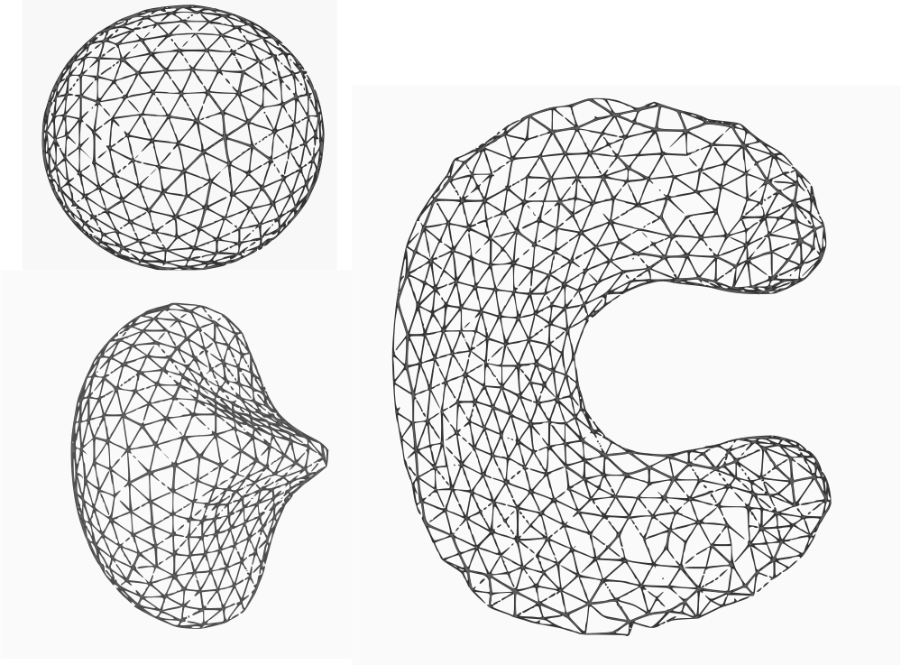
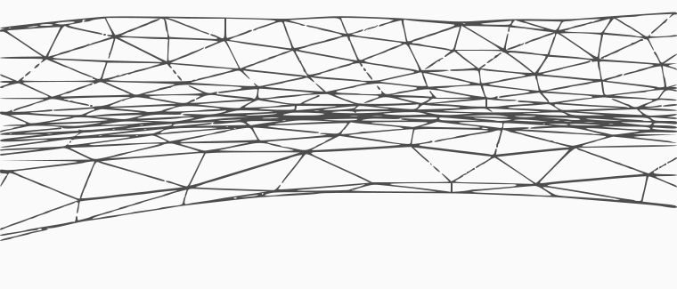

# Introduction

ElTopo.jl is a simple wrapper package for a C++ library [eltopo](https://github.com/tysonbrochu/eltopo) which is built with [ElTopoBuilder](https://github.com/akels/ElTopoBuilder). At the moment only Linux platform is supported, but since BinaryBuilder is being used and the library has instructions for it to be compiled on other architectures, it should not take much effort for adding support for other platforms. (Ofcourse, in a world where Cxx is a registred package ;)

# The API

As explained in [the main repository](https://github.com/tysonbrochu/eltopo):

> El Topo is a free C++ package for tracking dynamic surfaces represented as triangle meshes in 3D. It robustly handles topology changes such as merging and pinching off, while adaptively maintaining a tangle-free, high-quality triangulation.

There are three important functions in the ElTopo library `SurfTrack::improve_mesh`, `SurfTrack::topology_changes` and `SurfTrack::integrate`. The first two methods are combined under the name `stabilize` whereas latter one, which modifies tangential velocities to avoid vertex collisions, is not wrapped. 


```
using ElTopo

scale = 0.2
par = SurfTrack(
                   use_fraction = false,
                   min_edge_length = 0.7*scale,
                   max_edge_length = 1.5*scale,
                   max_volume_change = 0.1*scale^3,
                   min_curvature_multiplier = 1.0,
                   max_curvature_multiplier = 1.0,
                   merge_proximity_epsilon = 0.5*scale,
                   proximity_epsilon = 0.00001,
                   perform_improvement = true, 
                   collision_safety = false,
                   min_triangle_angle = 15,
                   max_triangle_angle = 120,
                   allow_vertex_movement = true,
                   use_curvature_when_collapsing = false,
                   use_curvature_when_splitting = false,
)

# Let's say we now have a `msh::HomogenousMesh`
newmsh = stabilize(msh,par)
```

# Showcase

To test the wrapper we integrated Enright velocity field which was was dicussed in [eltopo](https://github.com/tysonbrochu/eltopo) library's paper.

|  |   |
|---|---|
| Evolution | Thin features are preserved |
